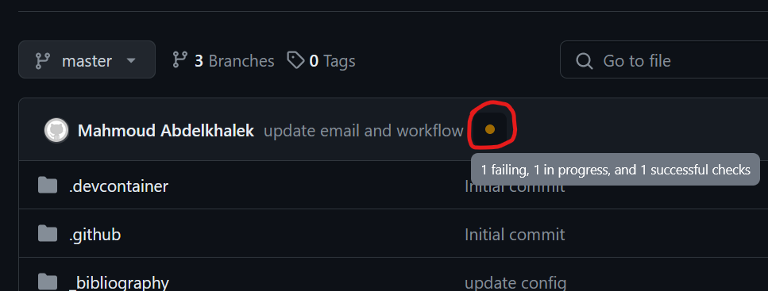
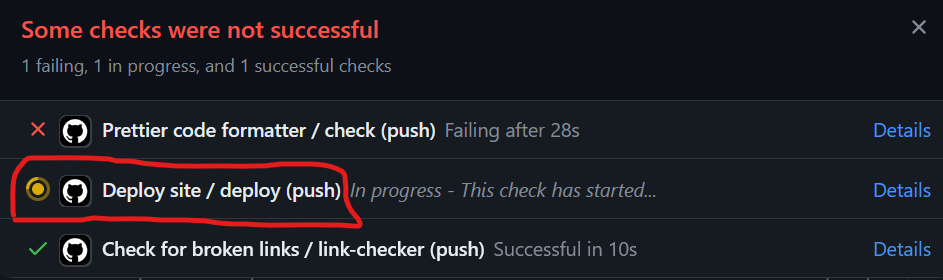
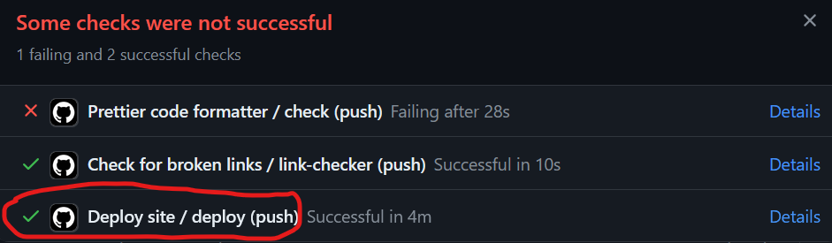

A typical workflow for editing the website and then deploying it proceeds as follows.

1. Locally, some aspect of the website is changed. This can be achieved by changing the
`_config.yml` file, any file in the `_includes` directory, any file in the `_layouts`
directory, and so on.
2. These changes are then saved, committed locally, and then pushed to the remote
repository corresponding to the website.
3. On GitHub, go to the `master` branch repository that corresponds to the website. You should then
see an orange dot next to the latest pushed commit to the repository, as shown in
Fig. 1 below. Click on this orange dot.

    
    **Fig. 1**

4. You should then see 3 actions in process, as shown in Fig. 2 below. The action that you are mainly interested in is the `Deploy site / deploy (push)` action, which, when completed, will deploy the website at https://mhdadk.github.io.

    
    **Fig. 2**

5. The orange dot in Fig. 2 above next to the `Deploy site / deploy (push)` action indicates that it is still in progress and not completed. There are two possible outcomes for this action: the action completes successfully, such that a green tick mark shows up next to the `Deploy site / deploy (push)` action (as shown in Fig. 3 below), or the action does not complete successfully, such that a red cross shows up next to the `Deploy site / deploy (push)` action.

    
    **Fig. 3**

6. If the `Deploy site / deploy (push)` action completes successfully, then you can access the latest version of the website at https://mhdadk.github.io. Otherwise, if the `Deploy site / deploy (push)` action does not complete successfully, then click on the "Details" link next to this action to find out what went wrong.

7. After clicking the "Details" link, you will usually be automatically be directed to where the error occured. This is usually under the "Install and Build" job. You will need to scroll through the logs associated with the "Install and Build" job to find the error, which will be highlighted in red.

8. Once all errors have been fixed, go back to step 1 to repeat this workflow for deploying the website.
